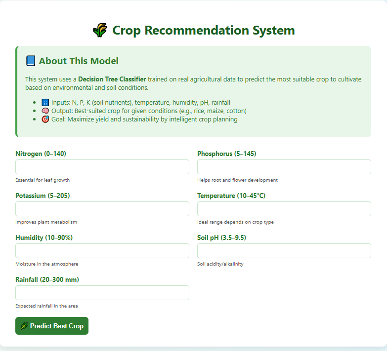
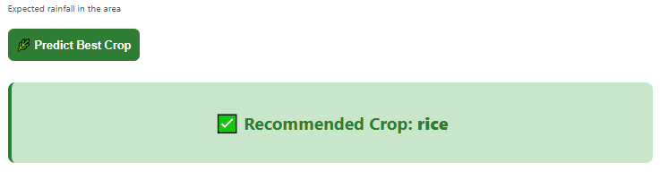

#  Crop Recommendation System using Decision Tree

##  Overview
This project is a **Flask web application** that predicts the most suitable crop for cultivation based on soil nutrients and environmental conditions.  
It uses a **Decision Tree Classifier** trained on the "Crop Recommendation Dataset".

---

##  Project Structure
```
project/
│
├── app.py                     # Flask application
├── decision_tree_model.pkl    # Trained Decision Tree model
├── dataset/
│   └── Crop_recommendation.csv # Dataset file
├── model/
│   └── train_model.py         # Script to train and save the model
├── templates/
│   └── index.html             # Frontend HTML form
|                    
└── README.md                  # Project documentation
```

---

## 🖼 Project Image Placeholder

Step1:Enter values 


------
Result page:



---

##  Dataset
The dataset contains **soil and climate features** to predict the best crop.

| Feature       | Description                                   |
|---------------|-----------------------------------------------|
| N             | Nitrogen content in soil (kg/ha)              |
| P             | Phosphorous content in soil (kg/ha)           |
| K             | Potassium content in soil (kg/ha)             |
| temperature   | Temperature in °C                             |
| humidity      | Relative humidity (%)                         |
| ph            | Soil pH value                                 |
| rainfall      | Rainfall in mm                                |
| label         | Recommended crop name                         |

---

##  Installation & Setup

1. **Clone the repository**
   ```bash
   git clone https://github.com/nithinskumar866/Decisiontree_algorithm.git
   cd --
   ```

2. **Install dependencies**
   ```bash
   pip install -r requirements.txt
   ```

3. **Train the model**
   ```bash
   python model/train_model.py
   ```
   This will generate `decision_tree_model.pkl`.

4. **Run the Flask app**
   ```bash
   python app.py
   ```

5. **Access the app**
   Open your browser and go to:
   ```
   http://127.0.0.1:5000
   ```

---

##  Usage
* Enter **soil and climate values** in the form.
* Click **Predict Crop**.
* The system will display the **recommended crop**.

---

##  Dependencies
* Python 3.8+
* Flask
* Pandas
* NumPy
* scikit-learn
* Pickle

Install all dependencies with:
```bash
pip install flask pandas numpy scikit-learn
```

---

##  Model Information
* **Algorithm**: Decision Tree Classifier
* **Training-Testing Split**: 80-20
* **Evaluation Metric**: Accuracy

---


